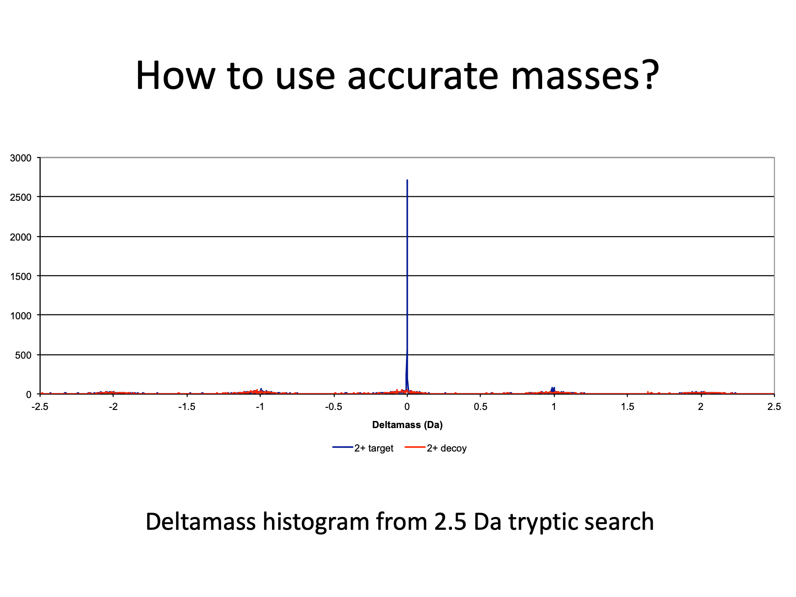

# RECOMB-CP_2012

### RECOMB computational proteomics meeting

#### April 6-8, 2012

#### San Diego, CA

#### Phil Wilmarth

---

## Shotgun proteomics analysis tutorial

- [proteomic pipeline overview](#background)
- [error control for variable modifications](#part-1)
- [proper parent ion mass tolerance settings and why](#part-2)
- [the relationship between PSM and protein inference errors](#part-3)

---

Powerpoint presentations from the 2012 RECOMB-CP meeting:

- RECOMB-CP_2012_tutorial_PW_2.ppt - tutorial lecture with notes
- PSR_PTM_20100414.ppt - earlier talk covering some of these topics

---

# Background

---

I would like to thank the conference organizers for the opportunity to speak to you today. I have been doing proteomics data analysis since 2003 when I started working for Dr. Larry David at OHSU. Dr. David now directs our University’s small proteomics core. When we got an LTQ instrument in 2005, the large datasets were hard to analyze. So I wrote our own data processing pipeline for large-scale shotgun proteomics experiments.

---

Despite the fact that proteomics experiments are really complex, we often depict the data analysis as some simple workflow like this where mass spec data flows into one end of a processing pipeline and biological results flow out the other end. However, these pipelines involve many steps with multiple choices at each step so I bet we all use different pipelines.

---

Maybe reality should look more like this. I will try and focus on general aspects of data analysis today that I hope will be applicable no matter which specific pipeline you use.

---

Here is what we will cover today. First, we will see how to identify phosphopeptides in large scale shotgun proteomics experiments. Then we will figure out how to use accurate mass measurements to improve data analyses. In the last section we will explore how protein errors and peptide errors are related to each other.

---

In order to put together this presentation, I had to decide how to define a more optimum analysis. Biologists are interested in proteins so I picked maximizing the number of identified proteins. Here we have data where we were trying different instrument methods to optimize protein detection sensitivity by analyzing 200 ng aliquots of an E. coli cell lysate digest. We can see that the number of identified MS2 spectra and the number of identified proteins in complex mixtures are highly correlated. So analyses that increase the total number of identified MS2 spectra are what we want.

---

To come up with numbers of identified spectra in these analyses comparisons, I used my processing pipeline. It performs well and here are its relevant details. I use a peptide-prophet-like discriminant function transformation of SEQUEST search scores to improve peptide identification sensitivity. The concatenated target/decoy database strategy is used to set score thresholds which avoids the need to perform distribution fitting. I divide peptides into subclasses and generate separate score lists and score histograms for each subclass. Subclasses can be different peptide charge states, different number of tryptic termini, modification status, etc. and can vary from experiment to experiment. To achieve an overall peptide FDR, I use that same FDR threshold for each subclass. An advantage to creating different subclasses is that you can find out where correct and incorrect IDs are located in search space.

---

We are going to see lots of score histograms today because big tables of search scores are not much fun to look at. Let’s take a minute and get familiar with these figures. The x-axis is the peptide-prophet-like discriminant function score. The y-axis is the frequency of matches at given scores. The score distribution for matches to the target half of the concatenated target/decoy database will be dark blue and will probably have two bumps: incorrect matches centered near zero and correct matches at higher scores.

---

The score distribution for matches to the decoy half of the database will be in red and will be centered near zero.

---

Both target and decoy score distributions will usually be overlaid in the same plot like this. Note that matches to the decoy database very nicely model the incorrect match distribution to the target database. Dotted vertical lines will be used to show the locations of score thresholds. Peptide FDR is the area under the red curve above the threshold divided by the area of the blue curve above the threshold. Matches with scores to the right of the thresholds are retained, and those to the left are rejected. To keep things simple and save time, I will mostly show 2+ peptide histograms today. Just keep in mind that there are several histograms associated with each sample or analysis.

---

# Part 1

---

Let’s look at how to detect phosphopeptides in a large-scale survey experiment. Leishmania are protozoan parasites transmitted by sand flies that cause disfiguring skin lesions, organ damage, and, in many cases, death. Leishmaniasis is a tropical disease affecting about 12 million people worldwide with about 60,000 deaths per year. The parasites can’t synthesize purines and must take them up from the host. Detecting protein changes in response to purine starvation may lead to new methods of prevention or treatment. The Ullman/Landfear labs at OHSU generated two biological replicates of promastigotes that were cultured in media with normal purine levels or in purine-depleted media (for 24 hours). Differential protein expression analysis was done using spectral counting. Invariably in these exploratory studies, an investigator will ask about phosphorylation because it is such an important biological process. Looking for phosphopeptides is a pretty straightforward thing to do, right? We add some variable modifications to SEQUEST, run the searches, filter the peptides to some reasonable FDR, compile the results, and send them to the clients.

---

Before we look at the results from the four-sample experiment, let’s see what the score histograms and thresholds looked like for one of the samples. I am showing all three charge states so you can see how they compare. The 2+ peptides in the middle and the 3+ peptides at the bottom have very similar looking score distributions. We usually get about 1.5 times as many 2+ IDs (33.7 thousand) as 3+ IDs (22.5 thousand). The 1+ IDs at the top are a small portion of the total identifications and have much less separation between incorrect and correct distributions. The dotted lines are thresholds located at 0.7% peptide false discovery rates.

The analysis workflow goes like this: SEQUEST result files are parsed, discriminant scores are computed and histograms generated, thresholds are determined by inspection of FDR tables and histograms, the data is filtered to retain matches above the thresholds, the filtered peptides are mapped to proteins, and results files generated. These data were from one of the purine-starved samples and the other three samples were analyzed similarly.

---

Here are the results from the four-sample experiment. There were a quarter million identified spectra out of 1.7 million. The total number of unique peptide sequences were mostly unmodified peptides, quite a few oxidized peptides, and a smaller number of phosphorylated peptides. The quarter million identified spectra mapped to 3,650 proteins with 60 decoy protein matches. This is roughly 46% of the entire proteome for this organism. I frequently look at the peptides matched to decoy proteins as a quality control check. Let’s look at the peptides associated with the 60 decoy proteins.

---

There were 147 unique decoy peptide sequences associated with the 60 decoy proteins. 28 were unmodified, 8 oxidized, and 110 that were phosphorylated. How many of you think that this pattern seems reasonable? How many think it looks fishy? The quarter million spectra were mostly unmodified peptides with a few phosphopeptides. The noise is the opposite with mostly phosphopeptides and few unmodified peptides. Obviously a global peptide FDR of 0.7% did not result in each of the three peptide subclasses having similar FDRs. It looks like the phosphopeptides might be particularly noisy. It was not too hard to tabulate the number of target and decoy peptides for each of these three subclasses and compute the individual peptide FDRs. It turns out that we had a low 0.2% FDR for unmodified peptides, 0.7% FDR for oxidation, and a whopping 29% FDR for phosphopeptides.

---

The global peptide FDR was actually a weighted sum of the three different FDRs. These are the numbers of spectra and FDRs associated with each subclass.

---

Here is a visual representation of what is going on. The histogram on the left is the sum of the histograms for the three peptide subclasses on the right. Signal and noise partition differently among the three subclasses. The correct target matches are predominantly unmodified peptides in contrast to the incorrect matches (the decoy matches), which are mostly phosphopeptides.  Adding an STY+80 variable modification to SEQUEST increases search time several fold. That means a large portion of search space must be associated with phosphopeptides. Because random noise is distributed equally across the search space, a large portion of the noise ends up in the phosphopeptide subclass. Since the signal to noise ratios are different in the different subclasses, we need to set independent thresholds for each subclass to make sure we get the same peptide FDRs across subclasses. Let’s look at each subclass and see where a 0.7% threshold would be located compared to the global threshold location shown here.

---

Here are the unmodified peptides. The gray dotted line is the previous global threshold location and the black doted line is the 0.7% peptide FDR location. Because we have less noise (smaller red distribution) than in the combined histogram, we can lower the threshold and recover more correct IDs.

---

Oxidized peptides were already at 0.7% FDR so there is no change in the threshold location.

---

Here are the phosphorylated peptide scores. I have expanded the y-axis so we can actually see the correct distribution. The previous threshold location (the gray line) was too low and we have to increase it by quite a bit to get a phosphopeptide FDR of 0.7%.

---

So how do the results from the peptides that passed the global thresholds on the left compare to the new set of peptides that passed the separate score thresholds on the right?

---

We identified significantly larger numbers of peptides and proteins in the new analysis, largely due to lowering the thresholds for the unmodified peptides. We identified 33,000 more spectra and 300 more proteins at the same FDRs.

---

What happened to the phosphopeptides? I am not sure if anyone has demonstrated that decoy databases accurately estimate modified peptide error rates. We can check that assumption for phosphopeptides. We can analyze neutral loss signatures in the MS2 spectra to see how likely it is that the spectrum contained a phosphorylated serine or threonine residue using a program from John Yate’s lab called Colander. The lower figure is the probability histogram from the 29% FDR data. We see that the lower figure has many spectra with low probabilities of being phosphopeptides and those have been removed in the top figure when we set the score threshold at 0.7%. We also see a trade-off between sensitivity and specificity. The top results are more accurate, but we have about 30% fewer spectra with high probabilities. We have not addressed site localization at all. However, by setting separate thresholds in each subclass, we can start with a more accurate set of phosphopeptides for subsequent analysis.

---

When you add variable modifications to searches they take longer. That means you have increased search space size. Noise is like water in a vessel, if you make the vessel bigger, the water spreads out. Since the variable modification is associated with a large portion of the search space, it get a large portion of the total noise. That is why we had to increase the score threshold for the phosphopeptides to control this increased noise. Conversely, since we have noise spread out over a larger search space, the noise associated with the unmodified peptides, a smaller portion of the search space, has been diluted, much like using dialysis membranes to clean up samples. With less noise present, we can lower thresholds and increase the numbers of identified peptides and proteins.

---

# Part 2

---

Early publications from the MacCoss and Coon labs suggested that wide parent ion mass tolerance searches followed by accurate mass filtering worked better for Orbitrap data, but many papers report using very narrow parent ion tolerance searches, such as 20 ppm. What is the better way to use accurate mass measurements? Peter Gillespie’s lab at OHSU studies inner ear auditory and vestibular organs. The hair bundle structures of these organs not only detect sound, they also detect head movement and do cool thinks like stabilize your vision. We have extensively analyzed inner ear hair bundles from chicken embryos in the past using our low resolution ion traps. There is not much material in these hair bundle structures and 100 utricle samples (50 embryos) only generates about 1 microgram of protein. The sample processing that has worked the best is a short gel run-in followed by a trypsin in-gel digest. One of Peter’s post docs, Jung-Bum Shin, is now a Professor at the University of Virginia and their proteomics core produced Orbitrap data for one of these samples. It was the usual method using high-resolution Orbitrap survey scans (300-1600 at 60K resolution) followed by low-resolution CID MS2 scans in the linear ion trap (top 20 method). The dataset was a little over 200 thousand MS2 scans.

---

I did SEQUEST searches with 3 different parent ion mass tolerances; 2.5 Da, 100 ppm, and 10 ppm. I also compared trypsin cleavage specificity to no enzyme specificity. There are situations where trypsin cleavage can’t be used, such as peptidome analysis, secreted samples, or when less specific proteases are used. Analyzing no enzyme searches is a little tricky, and it will be easier to understand if we look at that first without the complication of accurate masses.

---

Lets start with the 2.5 Da trypsin search results. Here are the score distributions for 2+ peptides. The distributions look very typical and at the 1% FDR threshold we get 7,300 identified spectra. Notice that we have quite a few likely correct IDs below our threshold. Because the noise distribution is large compared to the correct distribution, we have to set a relatively higher threshold to achieve a 1% FDR.

---

Here are the 2+ peptides from the 2.5 Da no enzyme search separated into different histograms by number of tryptic termini. Fully-tryptic peptides are on top, semi-tryptic peptides in the middle, and non-tryptic peptides on the bottom. 1% FDR thresholds are shown by the dotted lines and are quite a bit different in the fully-tryptic and semi-tryptic subclasses. We see that most of our signal stays in the fully-tryptic peptide subclass whereas most of our noise is in the fully-non-tryptic peptide subclass. We do not have any significant number of correct IDs for fully-non-tryptic peptides so we can exclude those and remove a large fraction of the noise. We had about 7,300 IDs from the tryptic search and we get an increase to 7,930 here. These histograms might remind you of what we just saw with unmodified and modified peptides in Part 1.

---

We can make the same kind of mistake we did with the phosphopeptide analysis and combine the scores for the different numbers of tryptic termini to get a score distribution that looks like this. The number of identifications passing a global threshold at the same 1% FDR is only about 67% of the number we got with the more proper no enzyme analysis on the previous slide. It is easy to get poor results when analyzing no enzyme searches if the number of tryptic termini subclasses are combined.

---

No enzyme searches usually take about 5-10 time longer that tryptic searches and we can represent this change in search space size visually. On the top is the search space for the tryptic search. Here, every incorrect match is a fully-tryptic peptide and 50% of the incorrect matches hit target proteins. When we do a no enzyme search on the bottom, we add larger numbers of semi-tryptic and completely non-tryptic peptides. Because of the small fraction of search space now associated with fully-tryptic target peptides, the chance that an incorrect match is a fully-tryptic target peptide has been dramatically reduced, to something like 5%.

---

Back to the main point, how do we make use of accurate mass measurements from the Orbitrap survey scans? Let’s explore the characteristics of deltamass values in the 2.5-Da tryptic search for 2+ peptides to see what we are dealing with. Deltamass was calculated as the measured parent ion mass minus the theoretical mass of the matched peptide sequence. We have a very large and very sharp peak at 0.0 Da associated with target matches.

---

It is hard to get a sense for how narrow the 0.0-Da peak is in a full range plot. Here we have expanded the regions around 0.0 Da and 1.0 Da. I have also switched to a log scale for the full-range plot so you can see the baseline noise more easily. The 0.0-Da peak is from unmodified correct IDs and it dominates the deltamass histogram. The noise level under the peak is around 30. The 1.0 Da region is composed of two peaks. The one at 0.98 Da is due to deamidation of asparagines. The other peak is from mis-triggers where the first isotopic peak was selected instead of the mono-isotopic peak. If we change the search parameters and use a narrower parent ion mass tolerance, we will simply select a narrow region around 0.0 Da and reject most of the noise, right?

---

Here is a similar deltamass histogram for the 100-ppm search. The x-scale is different from the previous slide and expanded by about a factor of 10. We still have a narrow peak at 0.0 Da but it is now sitting on a noise level of about 125 instead of 30. We did not reject the noise, we simply selected different noise; the noise that was within 100 ppm of the measured parent ion mass. Remember that there are usually many peptide candidates in each m/z window and search programs just return the top scoring peptides.

---

This “selecting” instead of “rejecting” noise is even more stunning in the 10-ppm searches. Note that the x-scale is even more expanded. I have also added the deltamass histogram for 3+ peptides on the bottom to show that the distributions are similar for different charge states. We now have piled all of our noise under our 0.0-Da peak and the noise level has increased to about 1000. We have managed to select a subset of the noise that is almost indistinguishable from our signal. A 10-ppm search reduces search space size with respect to deltamass values and reducing search space essentially concentrates the noise.

---

This is the analysis strategy that I adopted. We start by creating deltamass histograms and finding out where the correct signal is located. We can set very narrow windows in deltamass and create conditional discriminant score histograms for the matches that have deltamass values inside these narrow windows. We can then set score thresholds in the conditional histograms and process the data normally from that point on.

---

Here are a couple of example deltamass windows set for 2+ peptides. I made separate score histograms for the 0.0-Da window and the 1.0-Da window in the 2.5-Da parent ion tolerance searches because the two regions have very different signal-to-noise ratios and we have seen that signal-to-noise affects threshold locations. There are only 0.0-Da windows for the 100-ppm and 10-ppm searches.

---

Here we can see the effect that the deltamass filter had on the 2.5-Da no enzyme score histograms for fully-tryptic 2+ peptides. The no enzyme search itself gets rid of most of the noise for fully-tryptic peptides. Adding an orthogonal noise filter, the deltamass values inside the 0.0-Da window, essentially removes all the noise. We get a nice increase in identifications.

---

The situation is similar for the 100-ppm no enzyme search. The narrow 0.0-Da deltamass windows are able to remove most of the noise.

---

For the 10-ppm search, we see that the deltamass filter is not as effective as it was for the wider tolerance searches. Some noise was removed but quite a bit remains. As a consequence, the threshold could only be lowered a little and we do not see as much gain in sensitivity.

---

Now let’s look at the tryptic searches. Remember that all of our noise will be fully-tryptic so the top histogram has a large noise distribution that pushes the threshold to higher scores. This reduces the overall peptide detection sensitivity. In the wide-tolerance search, deltamass is an effective noise filter and we can see that it removes most of the noise distribution. This allows for a much lower threshold location and sensitivity is increased considerably.

---

Narrow deltamass filters also work for the 100-ppm tryptic search

---

We can immediately see that the 10-ppm tryptic search situation is not like the others. The ineffective deltamass noise filter does not remove noise that well and threshold location does not change very much. That is not the only problem we have going on here, though. Anyone have any thoughts on what looks different about these decoy distributions? They are broader and extend to much higher scores than we have seen so far. The narrow tolerance search is actually breaking our scoring function.

---

Most search programs have two types of scores: a primary y- and b-ion matching score (SEQUEST: Xcorr, MASCOT: ion score, X! Tandem: hyperscore, etc.) and what I will call a “statistical” score. For MASCOT the “statistical” score is the identity score. For X! Tandem it is the expectation score. For SEQUEST it is the DeltaCN value. These “statistical” scores are all related to some estimate of noise matches from the collection of scores for peptide candidates in a given m/z window. What if there is just one candidate? Or two? Or three? This chart shows the number of OUT files as a function of parent ion search tolerance. If there are zero candidates, SEQUEST does not write an OUT file. In the 10-ppm search, about 25% of the spectra have zero candidates. Many other spectra must have very sparse candidate numbers. Some other m/z values may have sufficient numbers of candidates and DeltaCN would still be OK. DeltaCN becomes an erratic classifier term. The discriminant function weights DeltaCN quite heavily, so discriminant scores are affected.

---

We have 3 parent ion mass tolerances, 2 enzymatic cleavages, and scores with and without narrow deltamass conditions for a total of 12 analysis permutations. I have summarized the number of identified spectra for the 12 cases in this line plot. The results where we used accurate masses are on the left, and those where we did not are on the right. We have a clear winner (green box), a clear loser (red box), and a pack in the middle. The wide tolerance tryptic search with narrow deltamass requirements does the best. The loser is the 100-ppm tryptic search when we ignored accurate masses. The number of identified proteins for these two cases are shown next to the boxes in bold with decoy matches in parentheses. The difference between the winner and loser is 3-fold for spectra and 2.4-fold for proteins. What is important to note is that all of these analysis choices are “publication quality”. In each case, the starting data were the same, the protein database was the same, and a strict peptide FDR of 1% was used. If you did not have prior knowledge that there were over 17,000 IDs possible, any of these analyses by themselves would sound completely valid. Even the “loser”.

---

To be able to judge whether a given number of IDs in an experiment is any good, we need context. It is pretty easy to estimate the maximum number of possible correct IDs. If we use concatenated, reversed decoy databases, we can simply subtract the number of decoy matches from the number of target matches. I did that for the 6 different search parameter combinations, and we see that each search has a different “starting” point. Some potentially correct fully-tryptic peptides with scores close to the noise level can get displaced by the additional non-tryptic noise matches evaluated in the expanded search space of no enzyme searches and this reduces the maximum numbers for the no enzyme searches.

---

We never get all of the potential correct peptides because we have to exclude the partially overlapping noise distributions. The bigger the incorrect distributions are relative to the correct distributions the more thresholds have to be raised to control noise. We can define the fraction of identifications that do make it past our filters as the “recovery”. The recovery for the 12 analysis strategies are shown here, separated by whether or not narrow deltamass filters were used. No enzyme searches have higher recoveries than tryptic searches. Using narrow deltamass windows improved recovery in all 6 searches.

---

The final outcomes, the bottom charts, are the products of the maximum potential number of IDs (the top charts) times the recovery factors (in the middle). I have lined them up vertically for the 12 cases in this slide. The 2.5 Da tryptic search with deltamass windows wins out because it has a high number of maximum IDs and a decent recovery factor.

---

Different search parameters create different “starting” points. Recovery varies, too. The number of identified peptides is the product of these two factors. Very narrow parent ion tolerances select noise that can be hard to remove from the signal. I would recommend using a wider parent ion tolerance followed by deltamass filtering rather than a narrow parent ion tolerance. This strategy allows signal to be distinguished from noise by accurate mass and is more compatible with the assumptions of our current generation of search programs.

---

# Part 3

---

We have seen examples of how search space size depends on search parameters and how that affects setting peptide thresholds. Another obvious thing that can affect search space size is the size of the protein database and this is another noise filter we can use. We will look at an example that most of us are probably using, but we may not realize it. We have pretty sophisticated methods for controlling peptide error rates, but what is the maximum tolerable peptide error rate for a given sample or experiment? We will derive an approximate mathematical relationship between peptide errors and protein errors to explore this. Lastly, is a 1% peptide false discovery rate the final word on error control?

---

Let’s represent mapping correct and incorrect peptides to proteins with a simple schematic like this. Most of the time, the subset of the target proteins present in the sample produce multiple peptides when digested with trypsin. Therefore, we expect multiple correct peptides to match to the proteins that are actually in our sample, as shown on the bottom from the blue oval where correct peptide matches cluster to correct proteins. The portion of the incorrect matches that occur by chance are expected to be distributed across the entire target database as shown on the top in red. We can have incorrect peptide matches to incorrect proteins or to correct proteins.

It is common to use a concatenated reversed decoy database, so let’s see what effect that has.

---

We assume that the presence of the decoy sequences will have little effect on the correct peptide matching so we have the same correct peptides mapping to the same sample proteins (bottom half of figure). Random matching of incorrect matches is now distributed along a database that is twice as big, as depicted at the bottom. A really important point is that the number of incorrect matches to the target database has been cut in half by doubling the size of the database. Because the number of incorrect matches to the target database has decreased, the odds that a match to the target database is correct have now increased. Using the concatenated decoy database actually removes noise and improves our analyses. The concatenated decoy database also lets us eavesdrop on the incorrect matches to the target database in the presence of the correct matches and this is why concatenated target/decoy databases give more accurate error estimates than using a separate decoy database.

Mapping correct peptides to correct proteins can be complicated so let’s not discuss that. Let’s instead think about decoy peptides mapping to decoy proteins. Forget about the target database for now.

---

Let’s imagine that the decoy protein database is like a big wall covered by lots of boxes, one box for each protein. To produce lists of identified proteins, we match non-redundant, unique peptide strings to protein sequence strings. So think of the peptide sequences as darts and we will model the peptide to protein mapping process as throwing darts at the wall. We will assume that each box has an equal likelihood of being hit by a dart.

A very widely used heuristic in proteomics analyses is requiring 2 peptides/protein. We can model that by throwing pairs of darts at the wall and seeing how many times we get 2 darts in the same box. So we take our basket of darts and randomly grab two darts. Let’s throw the first dart. Assuming that the dart throws are independent (an incorrect assumption), what are the odds that the second dart will land in the box with the first dart? There are 12 boxes… It would be 1 in 12, or, more generally, 1 out of the number of boxes N. Thus, 1/N is the probability of a successful trial (2 darts in one box). If the number of boxes is large compared to our number of darts and dart throws are independent, we can approximate the expected number of boxes having 2 darts as the number of trials times the probability of a successful trial. The number of trials when throwing pairs of darts is the number of combinations of darts taken 2 at a time.

---

The mathematical equations look like this. I have written out the formula for 1 dart per box, 2 darts per box and 3 darts per box explicitly so you don’t have to do algebra in your head. When the number of boxes is large compared to the number of darts, these approximations are reasonably good. In each case, we have a number of trials term (first term) and a probability of a successful trial term (the second term). Since we are really talking about mapping incorrect peptides to incorrect proteins, let’s cast things in those terms.

---

Since the number of decoy sequences is typically many 10s to hundreds, I have replaced the factorials with power expressions. There are a couple of important points to note. (1) the left sides of these equations, n, is the **number of incorrect proteins**. It is not a protein false discovery rate. (2) The variables on the right are the **number of incorrect peptide sequences**, d, and the total number of proteins in the database, N. Consider the 2 peptides/protein case. The number of incorrect proteins is inversely related to the size of the database. If the database is twice as big, we get half as many incorrect proteins. The number of incorrect proteins is related to the square of the number of incorrect sequences. If we double the number of incorrect sequences, we will get 4 times as many incorrect proteins. To see how the number of peptides per protein effects the number of incorrect proteins, let’s run some numbers.

---

This is easier to get a feel for if we look at some realistic numbers. Here we have two different sized databases: 7,000 would be something like yeast and 30,000 a higher organism like mouse or human. We have rows for 1, 2, or 3 peptides per protein. And we have two different numbers of incorrect peptide sequences: 500 and 1,000. The numbers of incorrect proteins in the last two columns are from a computer simulation where all protein matches are equally likely.

It is obvious that the number of peptides per protein has a big effect on the number of incorrect proteins. The roughly one-to-one relationship between peptide errors and protein errors for one peptide per protein has no inherent noise reduction when going from peptides to proteins. It is a bit too noisy for routine use. Three peptides per protein is a bit too much of a noise filter and hurts sensitivity in discovery-phase experiments where maximizing protein IDs is usually the goal. That leaves us with the classic two peptides per protein rule. It offers a fair degree of noise reduction and keeps the peptide identification thresholds honest. We can see how the size of the database is an important consideration. When we have 500 incorrect peptide sequences, we get 16 or so incorrect proteins for the 7,000 protein database. If we increase the database to 30,000 entries, then twice as many incorrect peptide sequences give a comparable 16 incorrect protein estimate.

---

Let’s compare peptide FDR error control to protein-level error control for some typical hypothetical samples. I chose 3 different sized datasets: 50K, 400K and one million spectra. I assumed an overall MS2 identification rate of 20%. Multiplying that number of identified peptides by the peptide FDR gives the number of incorrect MS2 spectra. I assumed that we get incorrect unique sequences at a 75% rate because we do get multiple copies of some decoy sequences. I used my simple approximate formula assuming a 20,000 sequence protein database and requiring 2 peptides/protein. I picked 125 proteins as the number of identified proteins for the smallest dataset because that is similar to some old LCQ experiments we did. I scaled the number of identified proteins linearly with dataset size and computed the protein FDRs in the last column. In the top half of the table we see that 1% peptide FDR does not guarantee a 1% protein FDR. Because we are usually reporting identified proteins, protein level error control might make more sense than peptide level error control. The bottom half of the table starts with a protein FDR of 2% and works backwards to compute what peptide FDR would be necessary to give that target protein FDR.

Different experiments can have different databases sizes, different dataset sizes, and different number of identifiable proteins; all of these factors effect error control. In practice, I start with a peptide FDR guess (5% if dataset size is small or 1% if large) and compile the results. I use the number of decoy proteins as the estimate of incorrect proteins and see what the protein FDR is. If it is too high or too low, I go back and adjust peptide thresholds accordingly. I think it makes sense to pick a desired protein FDR and then adjust the peptide FDR iteratively until you get the target number of incorrect proteins. It usually only takes a few iterations to get close enough.

---

Unfortunately, the previous discussion applies to single samples and many experiments have multiple samples. Here is some older data where we processed 10 biological replicates of human whole saliva. These were large MudPIT experiments generating between 300,000 and 400,000 spectra per sample. The blue curve on top shows the typical logarithmic increase in protein number as a function of number of replicates. We had about 220 proteins per sample and after 10 samples we have 612 total proteins. If we assume a 5% protein FDR per sample, that is about 11 incorrect proteins per sample. These incorrect IDs are seldom the same (except for titan) so we expect them to increase linearly with sample number, and after 10 replicates we would have 110 incorrect proteins. So 5% protein FDR per sample becomes 18% protein FDR for the entire experiment. We would typically want to report the 612 experiment-wide protein identifications, so we need to control experiment-wide protein FDR. Per sample peptide and protein FDRs may have to be reduced in multi-sample experiments adding another level of iteration and complication.

---

Increasing the size of your database can also be used to reduce noise and the common target/decoy database is one example. We have seen that protein database size is a direct component in the error process. Really small databases or reduced search space can cause problems. The number of peptides per protein is a powerful noise filter and 2 peptides per protein works best in most cases. Multi-sample experiments present some interesting challenges for error control.

---

I hope that a unifying theme of recognizing noise filters and using them to remove noise was apparent today. That is what I think proteomic data analysis is all about. There are many possible noise filters that can be used, and they all work a little differently. You may have to do some experimenting with your data to find the ones that give you the best results. Often trying a few data analysis options is necessary to figure out how the data should be analyzed. Always be cautious when dealing with new instruments, new methods, or new protocols. The data is probably different enough that what worked in the past may no longer apply. You should listen to your data instead of listening to me!

---

Before you stop listening to me today, I would like to thank the two collaborator labs for use of their data and Jerry Shurman for some math consulting. I would also like to thank Larry David (and my other co-workers), OHSU and NIH for support. And thanks to all of you for your time today.

---

---
---
